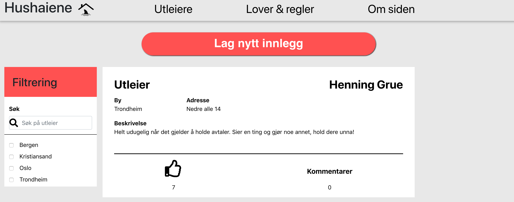
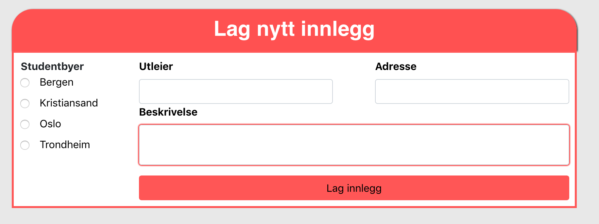

# Readme

The page is live on [https://Hushaiene.no](https://Hushaiene.no)

The repository is dubbed Svartelista as a working title since it was to replicate the [Svartelista Wordpress site](https://svartelista.wordpress.com/), but as a dedicated site against landlords who breaks the law or is just a hard time to deal with.

The site is made with React + Redux and uses a Firebase NoSQL database to handle the data.

The development is currently not ongoing due to other projects as well as university.

There is currently no login functionality, but anonymous users can write, comment, and like reviews.

